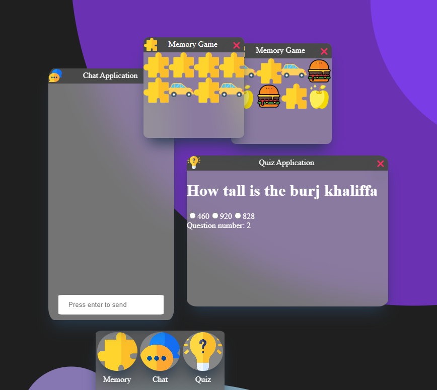

# Personal Web Desktop
This web application was created at my time at Linneaus University in the course Web Programming (1DV528)

# Test it yourself at: https://pwd.asturesson.se/

## Description of SPA application
This is an application where the user controls a PWD (Personal Web Desktop) which contains 3 working applications which can be run in parallel.
These application are the following:

 - Memory Game
	 

> A simple playable memory game in a 4x2 grid.

 - Chat Application

> A chat application where the user can chat in an open channel. Color coded for when you talk and when others talk.

 - Quiz Application

> A quiz app where the user needs to answer 5 questions to complete the quiz.

## Installation Instructions

**Prerequsites**
- A working nodejs installation

 Run: `npm run dev`. This will start the webserver in development enviroment

Run: `npm run serve`. This will start the webserver in a production ready state

Run `npm run build`. This will build the application for production.

**To execute linters**

Run: `npm run lint`. This will code check the entire app for styling issues.
